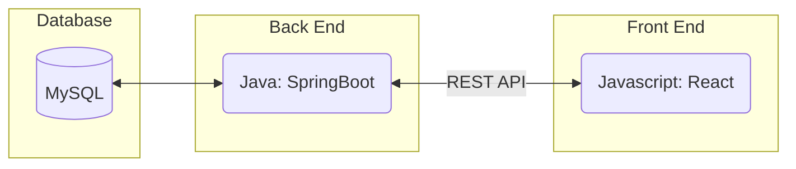
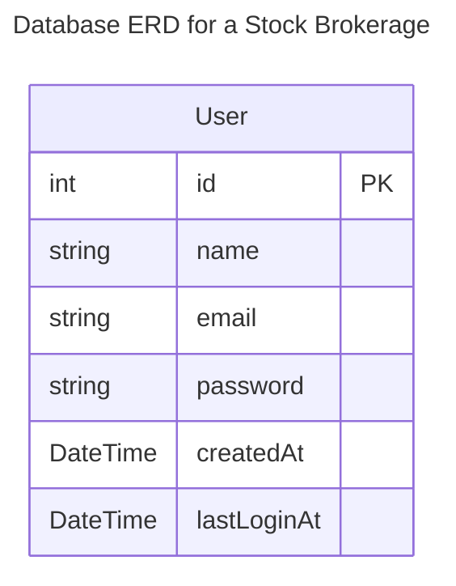
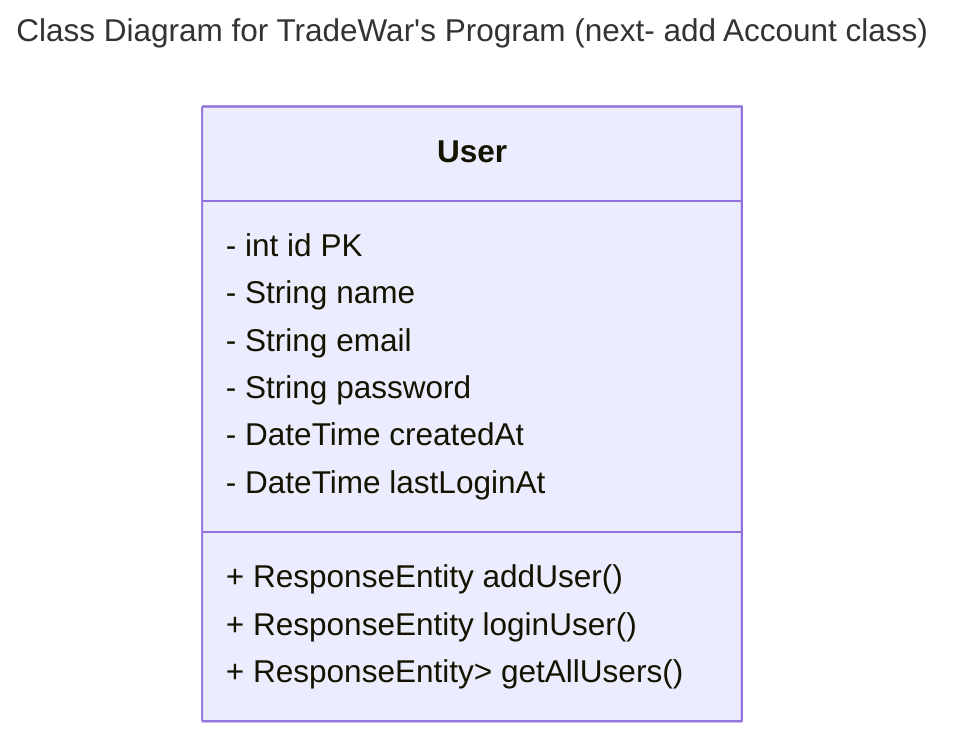
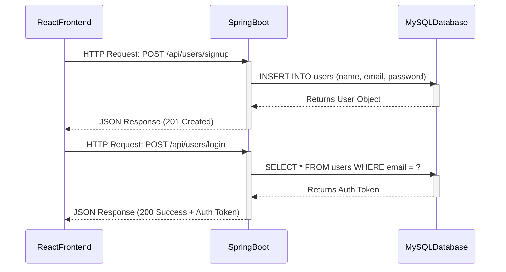
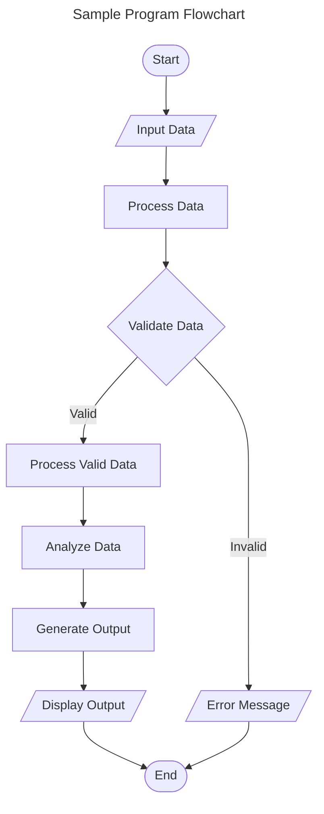
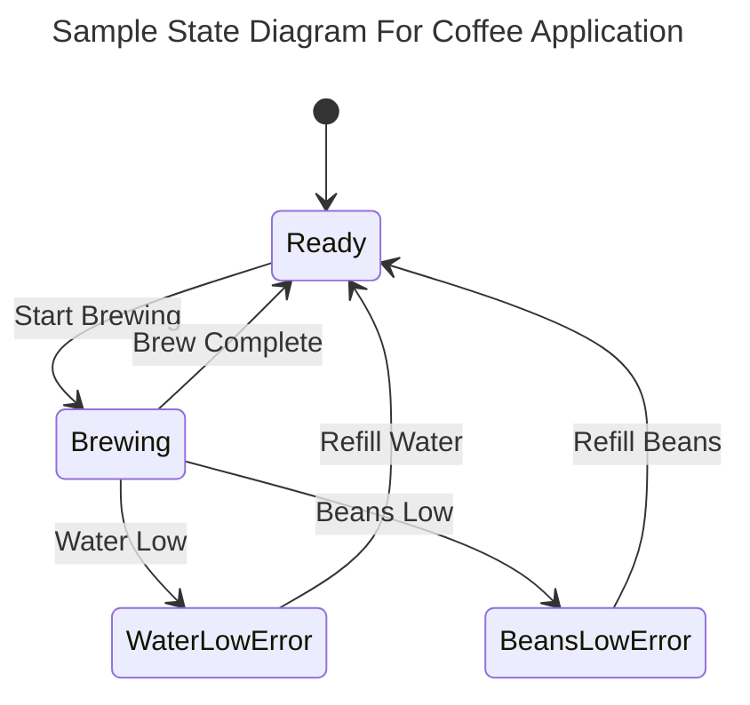

# Specification Document

Please fill out this document to reflect your team's project. This is a living document and will need to be updated regularly. You may also remove any section to its own document (e.g. a separate standards and conventions document), however you must keep the header and provide a link to that other document under the header.

Also, be sure to check out the Wiki for information on how to maintain your team's requirements.

## TeamName

Trade Wars - Team 8

### Project Abstract

<!--A one paragraph summary of what the software will do.-->

For this project our team will be creating an app that tracks the stock market and allows users to buy, sell, and otherwise interact with this market. It will include actual stock data scraped (in real time). It will make use of a database to store client/user data, including account names and passwords. 

### Customer
<!--A bri description of the customer for this software, both in general (the population who might eventually use such a system) and specifically for this document (the customer(s) who informed this document). Every project will have a customer from the CS506 instructional staff. Requirements should not be derived simply from discussion among team members. Ideally your customer should not only talk to you about requirements but also be excited later in the semes-->

The customers for this application will be users interested in investing in the stock market. This will include people that are invested in keeping up to date with stock market fluctuations and individuals that invest in certain stocks. 

### Specification

<!--A detailed specification of the system. UML, or other diagrams, such as finite automata, or other appropriate specification formalisms, are encouraged over natural language.-->

<!--Include sections, for example, illustrating the database architecture (with, for example, an ERD).-->

<!--Included below are some sample diagrams, including some example tech stack diagrams.-->

#### Technology Stack

<!-- Here are some sample technology stacks that you can use for inspiration: -->

#### Database

<!-- 
    User ||--o{ Order : "placed by"
    <!-- Order ||--o{ OrderItem : "contains"
    Product ||--o{ OrderItem : "included in"
    
    Order {
        int order_id PK
        int customer_id FK
        string order_date
        string status
    }

    Product {
        int product_id PK
        string name
        string description
        decimal price
    }

    OrderItem {
        int order_item_id PK
        int order_id FK
        int product_id FK
        int quantity
    } -->

#### Class Diagram

<!-- class Dog {
        + Dog(String name)
        + void makeSound()
    }
    class Cat {
        + Cat(String name)
        + void makeSound()
    }
    class Bird {
        + Bird(String name)
        + void makeSound()
    }
    Animal <|-- Dog
    Animal <|-- Cat
    Animal <|-- Bird -->

#### Sequence Diagram

 
 
 
 
 
 
 

#### Flowchart

#### Behavior

### Standards & Conventions

<!--This is a link to a seperate coding conventions document / style guide-->
[Style Guide & Conventions](STYLE.md)
